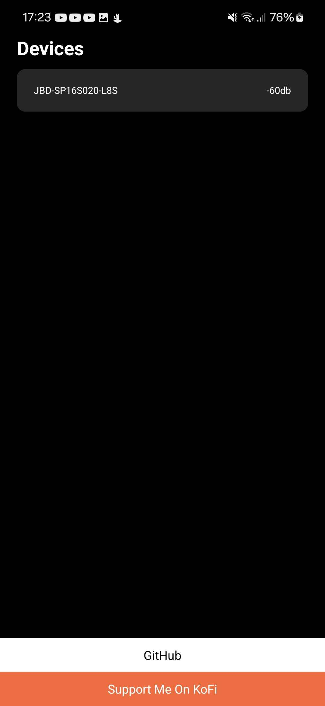
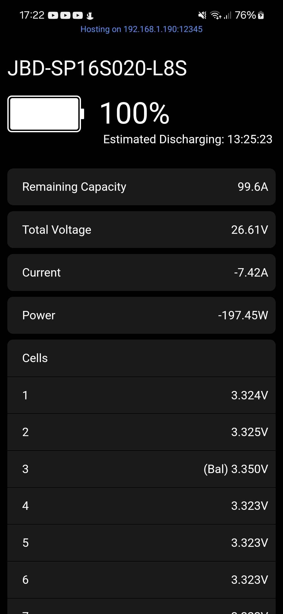
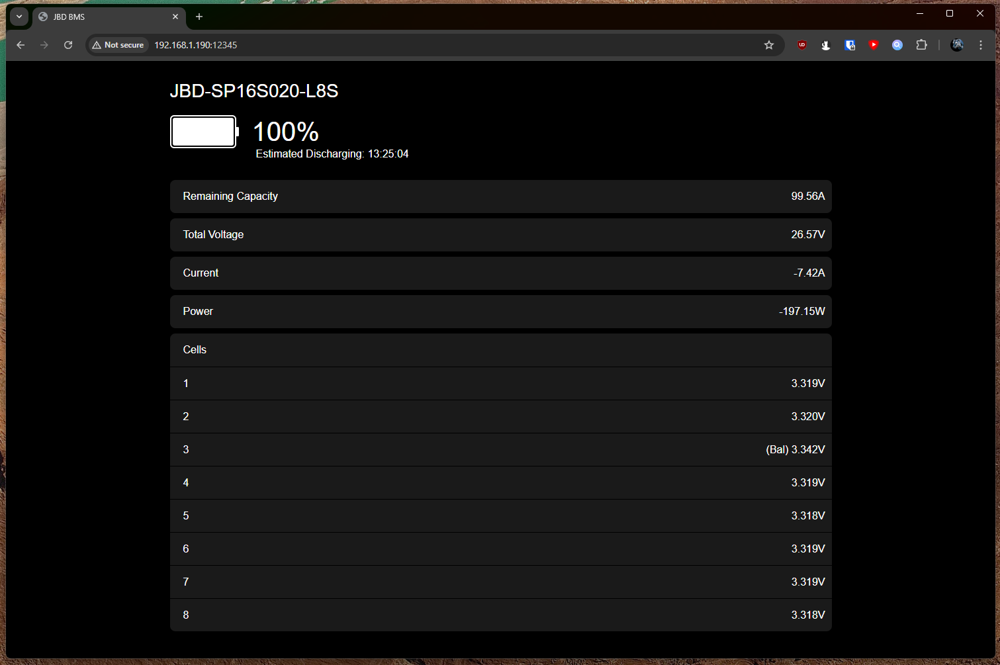

# React JBD BMS
React JBD BMS is a React Native app that allows you to connect to a JBD BMS and view its battery information.

This app also hosts a local web server on port `12345` where you can access the battery information from any device eg your phone.
### Mobile Screenshots

  </img>
  </img>

### Desktop Screenshots
</img>
## Running From Source
Without this patch, the app will not work:  
https://github.com/nodejs-mobile/nodejs-mobile-react-native/issues/62#issuecomment-2658725532
## Resources
https://github.com/neilsheps/overkill-xiaoxiang-jbd-bms-ble-reader/blob/main/src/main.cpp  
https://socket.dev/npm/package/jbd-overkill-bms-plugin/files/0.0.6/index.js  
https://jiabaida-bms.com/pages/download-files
